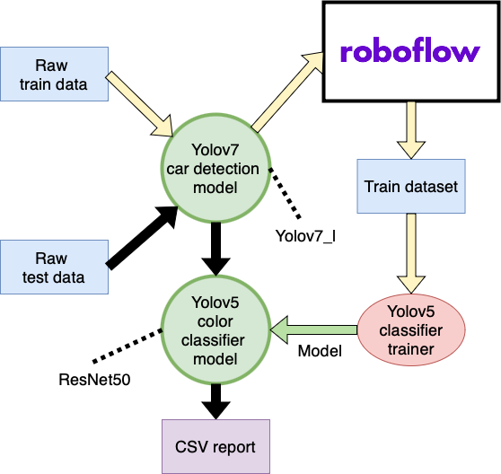
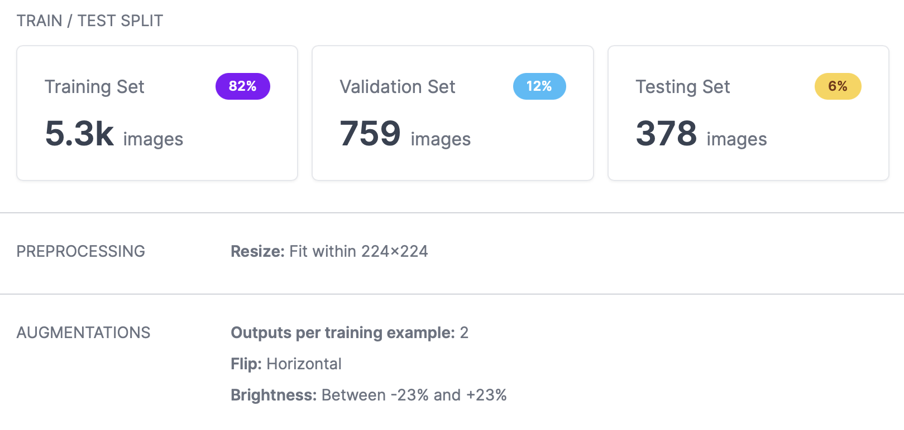

# RuCode 6.0
## Car color classification  

The solution uses Yolov7 for car detection task. Then the cropped cars are passed to the Yolov5 classifier, where the car color is classified.
## Prerequisites
1. `pip install -r requirements.txt`
2. Download [best_resnet50_1711_v2.pt](https://disk.yandex.ru/d/NIiEGkiHwPTrtw) and put in the `weights` folder

## Dataset preparation
1. Download `car_color_dataset` and unzip it in the project folder
2. Run `python prepare_train_data.py` to prepare train dataset (crop cars)  
3. Load the dataset from `cropped_train` to [roboflow.com](roboflow.com) and export with the following settings:
   
P.S. The size of the dataset in the picture is twice the size of `car_color_dataset`, since there will be 2 training images per image from `car_color_dataset`.
Processed dataset which was used for model training can be downloaded [here](https://disk.yandex.ru/d/ONPPB7eNGHO8EA)

## Model training
1. git clone https://github.com/ultralytics/yolov5
2. cd yolov5
3. pip install -r requirements.txt
4. Download and unzip dataset from `Dataset preparation` stage
5. Run `python classify/train.py --model resnet50.pt --data .\car_color_dataset_v4\ --epochs 25 --batch-size 64 --img 224 --workers 4`
6. The trained model `best.pt` will be in the `runs/**/weights/` folder
The training logs are available [here](https://disk.yandex.ru/d/45PJQ6dP4RbK5g) in the model folder

## Predicting
1. Put images to predict in the `test_data` folder
2. Run `python prepare_test_data.py` to prepare test dataset (crop cars)
3. Run `python predict_test_data.py` to make a prediction and generate a result report 

Predicted images will be located in the `predicted_test_data` folder.    
CSV report with car colors will be in the `reports` folder.  
There are csv reports for public and private tests in the `reports` folder